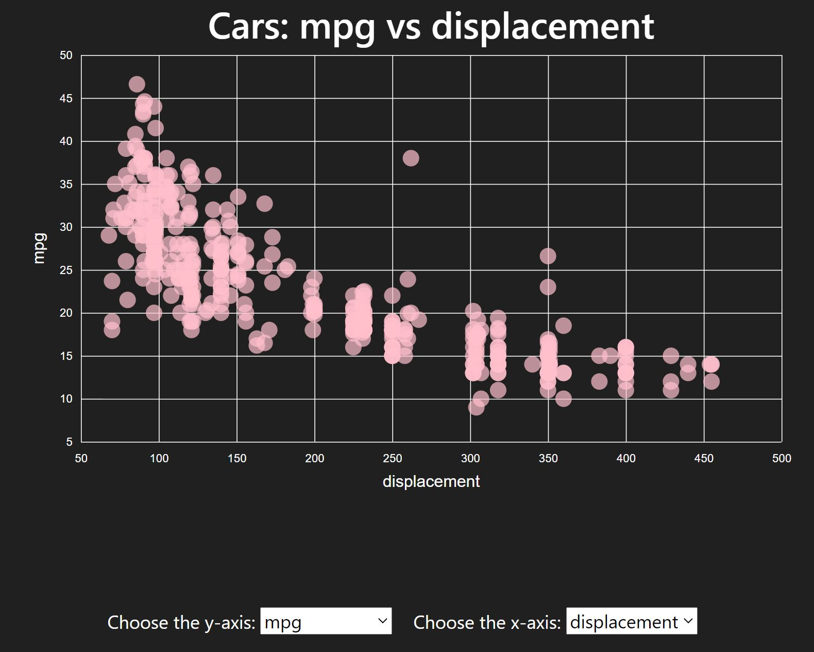
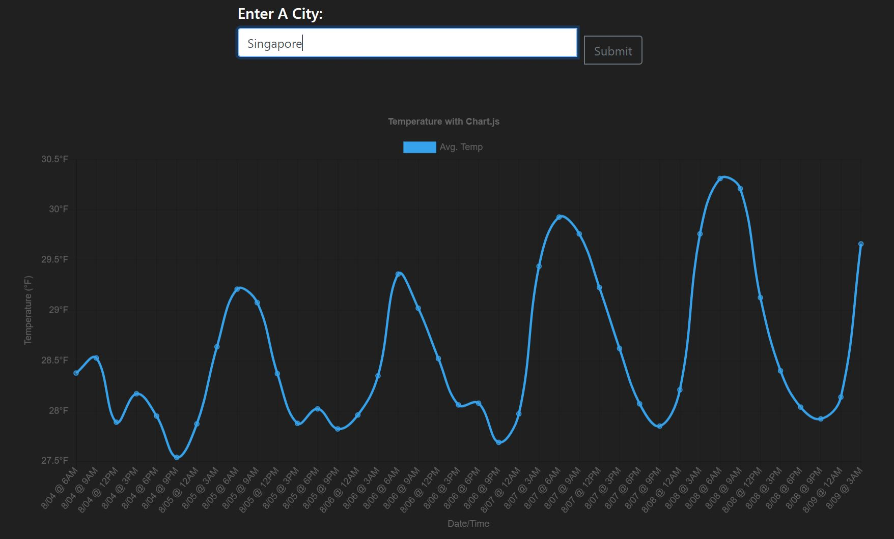

<<<<<<< HEAD
# nic-dsoviz
=======
# DSOViz Toolkit

[](https://github.com/vuejs/vue)
[](https://github.com/quasarframework/quasar)

A fast, modern, reactive visualisation toolkit. The DSOViz Toolkit puts together a comprehensive suite of visualisation and visual analytics components.

## Getting Started

To get started follow the following steps to get a hot-reloading development server up and running. 
There's a [guide](docs/setup_dev_environment.md) to setup the pre-getting-started development environment required if you're lost at this stage
```
Before running 'quasar dev', set up a Live Server for some datasets to be able to load.
eg live server: http://127.0.0.1:5500

### Install the dependencies
```bash
npm install
```

### Start the app in development mode (hot-code reloading, error reporting, etc.)
```bash
quasar dev
```

### Lint the files
```bash
npm run lint
```

### Build the app for production
```bash
quasar build
```

# Chart Components
* [Interactive ScatterplotMenu](https://vizhub.com/curran/98ba4daacc92442f8d9fd7d91bfd712a)  
    * used D3 library
    * axis can be changed using the dropdown menu



* GradientLine Chart
    * used [vuechart-js](https://vue-chartjs.org/)
    * data can be randomized when button is clicked


* Facebook Ads Dashboard
    * using data stored in 'src/data/fbdata.csv'
    * requires live server to be started to fetch data
    * components:
        * [quasar list](https://quasar.dev/vue-components/list-and-list-items)
        * [quasar search box](https://quasar.dev/vue-components/input)
        * [quasar table](https://quasar.dev/vue-components/table)
    * table shows a few of the columns from the CSV file
    * scrollable list sorted by alphabetical order
    * when item from list is selected, graph and table values change to display data of selected value
    * Zoom & Pan feature not yet implemented yet, replaced with a "Filter By Range" button to view a range of values


# Geospatial Component
* [Singapore Parks](https://data.gov.sg/dataset/parks)
    * HTML and JS files found in src/pages/geospatial/SGParks folder
    * run files in separate project, setting up nodemon server because SGParks.vue hover functions don't work yet
    * Displays Singapore Parks locations with Tree icons
    * Description of parks is provided in a table upon Hover.


* [Choropleth of Paraguay](https://github.com/voluntadpear/vue-choropleth)
    * used [vue2leaflet](https://vue2-leaflet.netlify.app/) package
    * displays Departments in Paraguay
    * on hover, shows the percentage of girls present in the particular department


# Graphs component
* [COVID-19 Data Visualisation](https://www.youtube.com/watch?v=cUSfL6MBmlY&t=87s)
    * used Axios package to access [API data from the US](https://covidtracking.com/api/us/daily)


* Weather and City Search
    * search box to enter city name
    * used an API to get [temperature data for 5 days](https://openweathermap.org/api)



